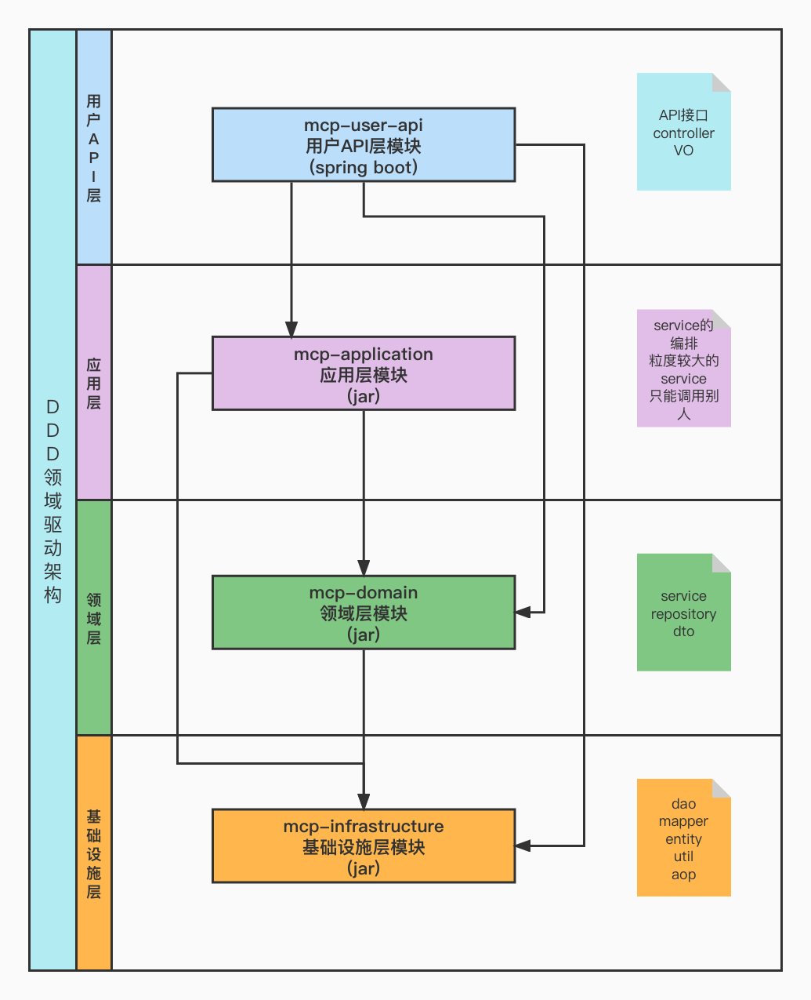

# 项目开发指南(Developing Guidance)
- Author: KG
- Date: 2022-04-10
- Version: 0.1.0 Alpha

## 1. 项目介绍

mcp-ddd-skeleton是一个基于领域驱动架构的4层模块的spring boot项目快速开发骨架。

&nbsp;

## 2. 项目技术栈

| 技术栈                  | 描述                                                        | 版本             |
|:---------------------| :----|:---------------|
| Spring Boot          | 开发主框架                                                     | 2.3.8.RELEASE  |
| MyBatis-Plus         | 数据访问框架                                                    |                |
| Flyway               | 数据库多环境DDL统一迭代更新和控制                                        |                |
| Lombok               | 代码的getter/setter/constructor/builder/toString方法等自动生成,简化代码 |                |
| Swagger              | API实时文档显示/调试/测试                                           |                |
| Knife4j              | API实时文档显示/调试/测试 - 国产                                      |                |
| MySQL                | 数据库                                                       |                |
| Logback              | 日志存储(用于记录入湖日志)                                            |                |

&nbsp;

## 3. 架构设计

- 模块架构图



<hr>

&nbsp;

## 4. 启动 & 部署

```
1. 本地启动模式需要在本地的MySQL下新建一个空的数据库collect_db
2. cd {Project Root}/mcp-ddd-skeleton
3. 打开pom.xml文件或pom.xml文件所在文件夹
4. 启动mcp-user-api模块下的McpApiApplication类(本地启动需要修改application-local.properties下的数据库密码为你本地的密码)
5. 如果启动成功, 访问地址: http://localhost:8090/swagger-ui/
   看到swagger界面则表示启动成功
```

&nbsp;

## 5. 项目开发规范

```
1.  [强制]类名一律Pascal命名法(单词首字母大写)。
2.  [强制]方法名一律camel命名法(第一个单词首字母小写, 其余单词首字母大写)。
3.  [强制]代码生成器生成的数据库实体类entity放在mcp-infrastructure模块下的entity包内。
4.  [强制]代码生成器生成的数据库mapper接口放在mcp-infrastructure模块下的mapper包内。
5.  [强制]代码生成器生成的数据库dao接口以及实现放在mcp-infrastructure模块下的dao包内,
         其中XxxDaoImpl实现类需要放在dao内部的impl包内。
6.  [强制]自定义的工具类命名要以XxxUtils形式放在mcp-infrastructure模块下的util包内。
7.  [建议]业务实体POJO类以XxxDto的形式放在mcp-domain模块下的dto包内。
8.  [建议]业务方法尽量减少try-catch, 和错误返回状态, 所有错误尽量以抛出自定义异常的方式进行,
         整个项目会通过接收异常链的方式进行全局异常捕获。
9.  [强制]自定义异常码写在mcp-domain模块内的exception包内的BusinessResultCode枚举类中。
10. [强制]业务逻辑处理类以IXxxService接口XxxServiceImpl实现的形式放在mcp-domain模块下的service包内,
         其中XxxServiceImpl实现类需要放在service内部的impl包内。
11. [建议]业务逻辑校验类以XxxValidator的形式放在mcp-domain模块下的validator包内。
12. [强制]业务流程编排类以XxxWorklow的形式放在mcp-application模块下的workflow包内。
13. [强制]所有外部交互的接口类(前端+外部系统)均以XxxController的形式放在mcp-user-api模块下的controller包内。
14. [强制]所有配置类以XxxConfig的形式放在mcp-user-api模块下的config包内。
```

&nbsp;

## 6. 附录(技术介绍)

1. Mybatis-Plus
   <br>
    
   ```
   简介:
   MyBatis-Plus (opens new window)（简称 MP）是一个 MyBatis的增强工具，
   在 MyBatis 的基础上只做增强不做改变，为简化开发、提高效率而生。
   
   官网地址: https://baomidou.com
   ```

<hr>

2. Flyway
   <br>
   
   ```
   简介:
   Version control for your database
   Robust schema evolution across all your environments.
   With ease, pleasure, and plain SQL.
   Flyway是一个开源的数据库迁移工具。
   通过在你的spring boot项目中内部增量sql语句来控制数据库的ddl, 
   从而达到数据库结构和数据在多环境下轻松简单的同步。
   
   官网地址: https://flywaydb.org
   ```

<hr>

3. Swagger
   <br>
   
   ```
   简介:
   Simplify API development for users, teams, and enterprises.
   API文档，调试，测试工具。
   
   官网地址: https://swagger.io
   ```


